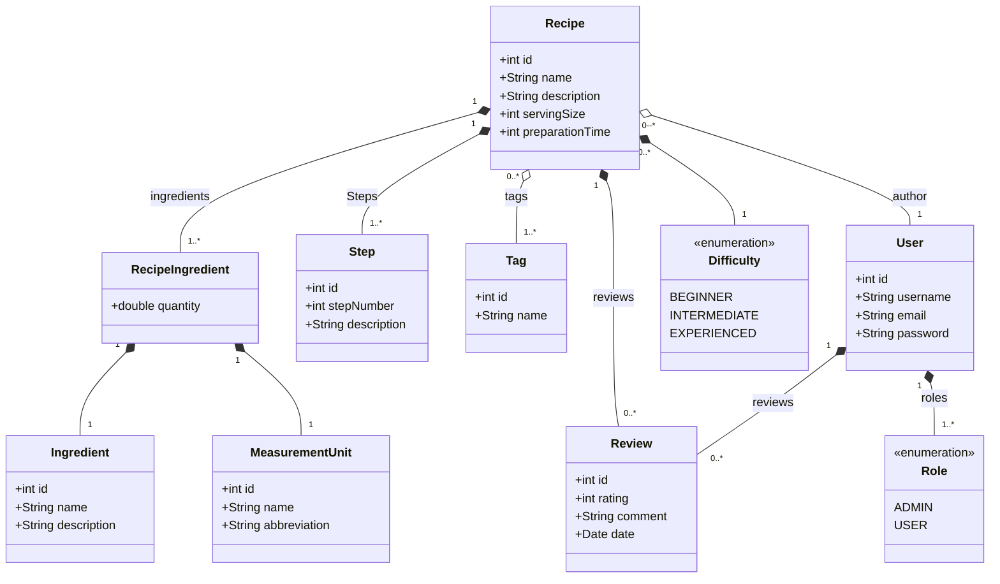

# Nossas Receitas (OurRecipes)

## Proposta

Criar um aplicativo de receitas culinarias, onde o usuario vai poder se cadastrar e logar, consequentemente podendo criar, consultar, alterar, avaliar e deletar receitas.

## Desenvolvimento

### Modelagem

Pensando na modelagem temos a receita como nossa classe principal, ou central, e o usuario para classe de controle. Considerando esses dados podemos criar uma primeira definção das classes do dominio do aplicativo.

#### Classes:

1. Recipe (Receita): Classe que vai modelar nossos principais objetos do sistema composta por:
   - id: identificador
   - name: nome da receita
   - description: uma breve descrição da receita
   - servingSize: quantidade de porções
   - preparationTime: tempo em minutos do preparo
   - ingredients: lista de ingredientes com suas quantidades 
   - steps: os procedimentos da receita
   - tags: informações que classificam seu tipo
   - difficulty: o grau de dificuldade do preparo
   - reviews: avaliações feitas pelos usuarios
   - author: o usuario que criou a receita

2. Ingredient:
   - id
   - name
   - description 
3. MeasurementUnit: devida a inumeras formas de medir os ingredientes, achei pertinente criar uma classe para unidades de medida.
   - id
   - name
   - abbreviation
4. RecipeIngredient:Os objetos de classe que serão colocados como ingredientes na receita pois unem os atributos abaixo:
   - ingredients
   - quantity
   - measurementUnit
   - recipe
5. Step:
   - id
   - stepNumber
   - description
   - recipe
6. Tag: Serve para definir tipos de receitas, como doce, salgado, vegano, sobremesa, confeito, carnes, salada, etc.
    - name
    - recipes
7. Difficulty "Enum": Um enumerado simples com 3 niveis de dificuldade:
   - BEGINNER
   - INTERMEDIATE
   - EXPERIENCED
8. Review: A avaliação do usuario
   - id
   - rating: um valor de 1 a 5 inclusive.
   - comment: comentario
   - recipe
   - user
9.  User:
    - id
    - username
    - email
    - password
    - recipes
    - reviews
    - roles: niveis de acesso do usuario
10. Role "Enum":
    - ADMIN: podera editar e deletar qualquer receita
    - USER: podera editar e deletar apenas suas receitas 

#### Diagrama de Classes

### Escolha das Tecnologias
Para desenvolver o Nossas Receitas (OurRecipes), optei por tecnologias que aliam eficiência, escalabilidade e minha familiaridade como desenvolvedor. Abaixo, detalho as principais escolhas para o back-end, front-end e banco de dados.

#### ***Back-end:*** Java com Spring Boot
O Spring Boot foi a base para a construção do back-end por diversos motivos:

- **Familiaridade:** Como desenvolvedor habituado ao ecossistema Java, essa escolha permite maior agilidade e produtividade.
- **Framework consolidado:** O Spring Boot é amplamente reconhecido por sua robustez e suporte a padrões de mercado, como REST APIs e integração com bancos de dados.
- **Facilidade de integração:** Com suporte nativo para validações, segurança (Spring Security) e ferramentas ORM (Hibernate/JPA), ele facilita a implementação de uma aplicação bem estruturada e escalável.
Além disso, o uso do Java oferece:

- **Tipagem estática:** Garante maior segurança no desenvolvimento e evita erros em tempo de execução.
Portabilidade: Permite a execução em qualquer ambiente com suporte a JVM.

#### ***Front-end:*** Next.js com TypeScript
No front-end, optei pelo Next.js combinado com TypeScript. Essa escolha foi baseada nos seguintes fatores:

- **Next.js:**
Framework React de alto desempenho, que permite renderização no lado do servidor (SSR) e no lado do cliente (CSR). Isso melhora o SEO e a experiência do usuário.
Rotas dinâmicas facilitam a criação de interfaces específicas para as receitas e avaliações.
- **TypeScript:**
Por ser uma linguagem tipada, o TypeScript se aproxima do estilo de programação do Java. Isso garante maior segurança e previsibilidade ao desenvolver componentes e serviços.
Ajuda a identificar erros durante o desenvolvimento, aumentando a qualidade do código.

#### ***Banco de Dados:*** PostgreSQL
O banco de dados escolhido foi o PostgreSQL, devido a:

- **Desempenho:** Ideal para aplicações com grande volume de dados e suporte a consultas complexas.
- **Confiabilidade:** É um banco de dados robusto, amplamente utilizado em produção.
- **Recursos avançados:** Suporte a chaves primárias compostas, relacionamentos complexos e extensões úteis, como o pgcrypto para hashing seguro de senhas.
- **Compatibilidade:** O Spring Data JPA oferece integração nativa com o PostgreSQL, simplificando a configuração e o acesso aos dados.
