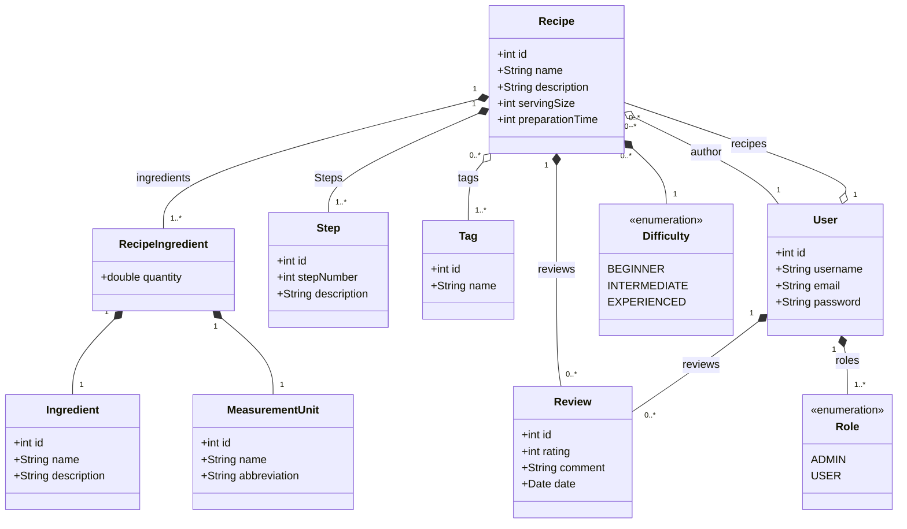

# Nossas Receitas (OurRecipes)

## Proposta

Criar um aplicativo de receitas culinarias, onde o usuario vai poder se cadastrar e logar, consequentemente podendo criar, consultar, alterar, avaliar e deletar receitas.

## Desenvolvimento

### Modelagem

Pensando na modelagem temos a receita como nossa classe principal, ou central, e o usuario para classe de controle. Considerando esses dados podemos criar uma primeira definção das classes do dominio do aplicativo.

#### Classes:

1. Recipe (Receita): Classe que vai modelar nossos principais objetos do sistema composta por:
   - id: identificador
   - name: nome da receita
   - description: uma breve descrição da receita
   - servingSize: quantidade de porções
   - preparationTime: tempo em minutos do preparo
   - ingredients: lista de ingredientes com suas quantidades 
   - steps: os procedimentos da receita
   - tags: informações que classificam seu tipo
   - difficulty: o grau de dificuldade do preparo
   - reviews: avaliações feitas pelos usuarios
   - author: o usuario que criou a receita

2. Ingredient:
   - id
   - name
   - description 
3. MeasurementUnit: devida a inumeras formas de medir os ingredientes, achei pertinente criar uma classe para unidades de medida.
   - id
   - name
   - abbreviation
4. RecipeIngredient:Os objetos de classe que serão colocados como ingredientes na receita pois unem os atributos abaixo:
   - ingredients
   - quantity
   - measurementUnit
   - recipe
5. Step:
   - id
   - stepNumber
   - description
   - recipe
6. Tag: Serve para definir tipos de receitas, como doce, salgado, vegano, sobremesa, confeito, carnes, salada, etc.
    - name
    - recipes
7. Difficulty "Enum": Um enumerado simples com 3 niveis de dificuldade:
   - BEGINNER
   - INTERMEDIATE
   - EXPERIENCED
8. Review: A avaliação do usuario
   - id
   - rating: um valor de 1 a 5 inclusive.
   - comment: comentario
   - recipe
   - user
9.  User:
    - id
    - username
    - email
    - password
    - recipes
    - reviews
    - roles: niveis de acesso do usuario
10. Role "Enum":
    - ADMIN: podera editar e deletar qualquer receita
    - USER: podera editar e deletar apenas suas receitas 

#### Diagrama de Classes

