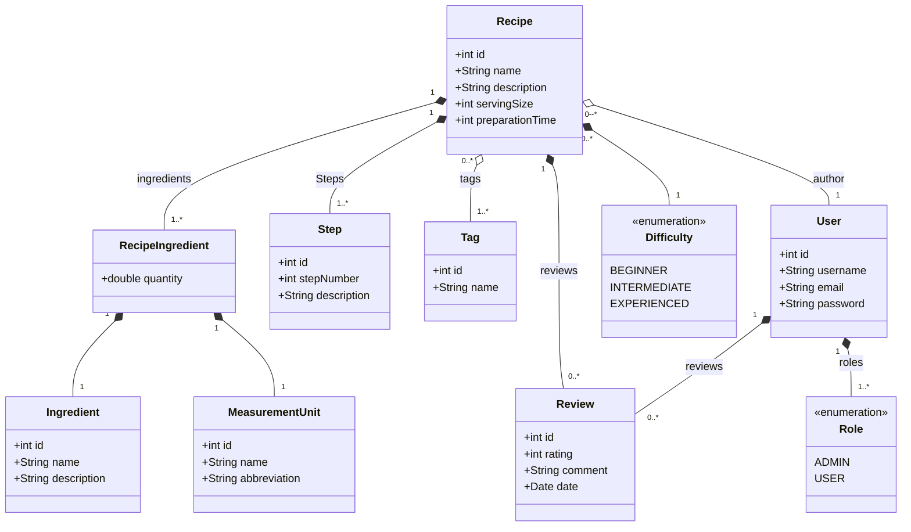

# Nossas Receitas (OurRecipes)

## Proposta

Criar um aplicativo de receitas culinarias, onde o usuario vai poder se cadastrar e logar, consequentemente podendo criar, consultar, alterar, avaliar e deletar receitas.

## Desenvolvimento

### Modelagem

Pensando na modelagem temos a receita como nossa classe principal, ou central, e o usuario para classe de controle. Considerando esses dados podemos criar uma primeira definção das classes do dominio do aplicativo.

#### Classes:

1. Recipe (Receita): Classe que vai modelar nossos principais objetos do sistema composta por:
   - id: identificador
   - name: nome da receita
   - description: uma breve descrição da receita
   - servingSize: quantidade de porções
   - preparationTime: tempo em minutos do preparo
   - ingredients: lista de ingredientes com suas quantidades 
   - steps: os procedimentos da receita
   - tags: informações que classificam seu tipo
   - difficulty: o grau de dificuldade do preparo
   - reviews: avaliações feitas pelos usuarios
   - author: o usuario que criou a receita

2. Ingredient:
   - id
   - name
   - description 
3. MeasurementUnit: devida a inumeras formas de medir os ingredientes, achei pertinente criar uma classe para unidades de medida.
   - id
   - name
   - abbreviation
4. RecipeIngredient:Os objetos de classe que serão colocados como ingredientes na receita pois unem os atributos abaixo:
   - ingredients
   - quantity
   - measurementUnit
   - recipe
5. Step:
   - id
   - stepNumber
   - description
   - recipe
6. Tag: Serve para definir tipos de receitas, como doce, salgado, vegano, sobremesa, confeito, carnes, salada, etc.
    - name
    - recipes
7. Difficulty "Enum": Um enumerado simples com 3 niveis de dificuldade:
   - BEGINNER
   - INTERMEDIATE
   - EXPERIENCED
8. Review: A avaliação do usuario
   - id
   - rating: um valor de 1 a 5 inclusive.
   - comment: comentario
   - recipe
   - user
9.  User:
    - id
    - username
    - email
    - password
    - recipes
    - reviews
    - roles: niveis de acesso do usuario
10. Role "Enum":
    - ADMIN: podera editar e deletar qualquer receita
    - USER: podera editar e deletar apenas suas receitas 

#### Diagrama de Classes


## Escolha das Tecnologias
Para desenvolver o Nossas Receitas (OurRecipes), optei por tecnologias que aliam eficiência, escalabilidade e minha familiaridade como desenvolvedor. Abaixo, detalho as principais escolhas para o back-end, front-end e banco de dados.

### ***Back-end:*** Java com Spring Boot
O Spring Boot foi a base para a construção do back-end por diversos motivos:

- **Familiaridade:** Como desenvolvedor habituado ao ecossistema Java, essa escolha permite maior agilidade e produtividade.
- **Framework consolidado:** O Spring Boot é amplamente reconhecido por sua robustez e suporte a padrões de mercado, como REST APIs e integração com bancos de dados.
- **Facilidade de integração:** Com suporte nativo para validações, segurança (Spring Security) e ferramentas ORM (Hibernate/JPA), ele facilita a implementação de uma aplicação bem estruturada e escalável.
Além disso, o uso do Java oferece:

- **Tipagem estática:** Garante maior segurança no desenvolvimento e evita erros em tempo de execução.
Portabilidade: Permite a execução em qualquer ambiente com suporte a JVM.

### ***Front-end:*** Next.js com TypeScript
No front-end, optei pelo Next.js combinado com TypeScript. Essa escolha foi baseada nos seguintes fatores:

- **Next.js:**
Framework React de alto desempenho, que permite renderização no lado do servidor (SSR) e no lado do cliente (CSR). Isso melhora o SEO e a experiência do usuário.
Rotas dinâmicas facilitam a criação de interfaces específicas para as receitas e avaliações.
- **TypeScript:**
Por ser uma linguagem tipada, o TypeScript se aproxima do estilo de programação do Java. Isso garante maior segurança e previsibilidade ao desenvolver componentes e serviços.
Ajuda a identificar erros durante o desenvolvimento, aumentando a qualidade do código.

### ***Banco de Dados:*** PostgreSQL
O banco de dados escolhido foi o PostgreSQL, devido a:

- **Desempenho:** Ideal para aplicações com grande volume de dados e suporte a consultas complexas.
- **Confiabilidade:** É um banco de dados robusto, amplamente utilizado em produção.
- **Recursos avançados:** Suporte a chaves primárias compostas, relacionamentos complexos e extensões úteis, como o pgcrypto para hashing seguro de senhas.
- **Compatibilidade:** O Spring Data JPA oferece integração nativa com o PostgreSQL, simplificando a configuração e o acesso aos dados.

## Estrutura do Projeto

A aplicação foi desenvolvida com uma organização clara, separando responsabilidades entre front-end e back-end para garantir manutenibilidade e escalabilidade. Abaixo, detalho a estrutura de cada parte do projeto.

### Front-end

O front-end utiliza a estrutura de páginas do Next.js, que facilita o roteamento e a organização de funcionalidades. O projeto está dividido em pastas principais dentro de src, com as seguintes responsabilidades:

```bash
src/
├───app/                # Diretório principal para páginas e roteamento
│   ├───fonts           # Configuração de fontes personalizadas
│   ├───list            # Página para listar receitas
│   ├───login           # Página de login
│   ├───recipe          # Páginas relacionadas às receitas
│   │   ├───new         # Página para criar nova receita
│   │   └───[id]        # Página de detalhes da receita (dinâmica)
│   │       └───edit    # Página para editar uma receita
│   └───register        # Página de registro de novos usuários
├───components/         # Componentes reutilizáveis (botões, formulários, etc.)
├───context/            # Contextos globais, como autenticação
└───resource/           # Funções e APIs para consumir dados
    ├───recipe          # Recursos relacionados às receitas
    └───user            # Recursos relacionados aos usuários
```

### Back-end

O back-end foi projetado seguindo a Arquitetura Hexagonal, desacoplando o domínio do sistema das bibliotecas externas e frameworks. Isso foi feito através de adaptadores e portas bem definidas. A estrutura do projeto está organizada da seguinte forma:

```graphql
our_recipes_api/
├───adapters/                # Adaptadores conectando o domínio ao mundo externo
│   ├───persistence/         # Persistência de dados
│   │   └───repository/      # Repositórios para acesso ao banco de dados
│   │       └───entities/    # Entidades JPA mapeadas para o banco de dados
│   └───web/                 # Camada de interação com a web (REST Controllers)
│       └───dto/             # Objetos de transferência de dados (DTOs)
├───domain/                  # Núcleo do sistema
│   ├───exception/           # Exceções específicas do domínio
│   ├───model/               # Modelos de negócio (entidades do domínio)
│   ├───ports/               # Interfaces para comunicação entre camadas
│   │   ├───in/              # Portas de entrada (ex.: casos de uso)
│   │   └───out/             # Portas de saída (ex.: persistência, APIs externas)
│   └───service/             # Implementação de regras de negócio
└───infrastructure/          # Configuração e detalhes técnicos
    ├───configuration/       # Configurações do Spring
    │   ├───bean/            # Configurações de beans
    │   └───security/        # Configurações de segurança (ex.: autenticação)
    └───exceptionHandler/    # Tratamento global de exceções
```

### Por que essa estrutura?

- **Front-end:**
  - O uso da estrutura de páginas do Next.js simplifica o roteamento e mantém o código organizado.
  - A separação entre components e context facilita a reutilização de código e o gerenciamento de estado.
- **Back-end**
  - A Arquitetura Hexagonal isola o domínio do sistema, permitindo mudanças nos frameworks ou nas bibliotecas externas sem afetar as regras de negócio.
  - Adaptadores (persistence, web) e portas (in, out) promovem clareza e modularidade.
  - A divisão entre configuração e infraestrutura garante que o código principal não seja sobrecarregado com detalhes técnicos.

Essa organização torna o sistema extensível, modular e mais fácil de manter a longo prazo.

## Executando a Aplicação

A aplicação é composta por dois segmentos principais: o front-end (our-recipes-next) e o back-end (our-recipes-api). Abaixo, descrevemos duas formas de executar o projeto: utilizando o código-fonte ou imagens pré-criadas no Docker Hub.

### Requisistos

Certifique-se de ter os seguintes requisitos instalados em sua máquina:
- Docker e Docker Compose
- Node.js e npm (para o front-end, se optar por rodar localmente)
- JDK 17 e Maven (para o back-end, se optar por rodar localmente)

1. #### **Usando o código-fonte:**
   Se você deseja executar a aplicação a partir do código-fonte, siga os passos abaixo:
   1. **Clone o repositório:**
    ```bash
     git clone https://github.com/Drufontael/our-recipes.git  
     cd our-recipes
    ```  
   2. **Instale as dependências:**
        - Front-end:
            ```bash
            cd our-recipes-next  
            npm install  
            cd ..
            ```
        - Back-end
            ```bash
            cd our-recipes-api  
            mvn clean install 
            mvn package 
            cd .. 
            ``` 
    3. **Suba os serviços com Docker Compose:**<br> 
        Na pasta raiz do repositório:
        ```bash
        docker-compose up -p
        ```
    4. **Acesse a aplicação:**
        - O front-end estará disponível em: http://localhost:3000
        - O back-end estará disponível em: http://localhost:8080
    5. **Povoar o banco de dados (opcional):**<br>
        No diretório our-recipes-api/src/main/resources, você encontrará scripts SQL para popular o banco de dados com dados iniciais. Execute os scripts manualmente em seu banco Postgres se necessário.
2. #### **Usando imagens Docker do Docker Hub:**
   Caso prefira, você pode utilizar as imagens Docker já prontas hospedadas no Docker Hub:
   1. **Crie um arquivo docker-compose.yml:**<br>
    No diretório de sua escolha, crie um arquivo docker-compose.yml com o seguinte conteúdo:
    ```yaml
    version: '3.8'  
    services:  
        postgres:  
            image: postgres:15  
            container_name: our-recipes-postgres  
            environment:  
            POSTGRES_USER: youruser  
            POSTGRES_PASSWORD: yourpassword  
            POSTGRES_DB: ourrecipes  
            ports:  
            - "5432:5432"  
            volumes:  
            - db_data:/var/lib/postgresql/data  

        our-recipes-api:  
            image: drufontael/ourrecipes-api:v1  
            container_name: our-recipes-api
            environment:
                - 'POSTGRES_HOST=postgress'  
            ports:  
            - "8080:8080"  
            depends_on:  
            - postgres  

        our-recipes-next:  
            image: drufontael/ourrecipes-next:v1  
            container_name: our-recipes-next  
            ports:  
            - "3000:3000"  
            depends_on:  
            - our-recipes-api
    
    networks:
        minha_rede:
            driver: bridge

    volumes:  
        db_data:
    ```
    2. **Suba os serviços:**<br>
    Na pasta onde o arquivo docker-compose.yml foi salvo, execute:
      ```bash
        docker-compose up -p
    ```
    3. **Acesse a aplicação:**
        - O front-end estará disponível em: http://localhost:3000
        - O back-end estará disponível em: http://localhost:8080
    4. **Povoar o banco de dados (opcional):**<br>
        Para popular o banco, siga os passos mencionados na opção anterior para executar os scripts SQL manualmente.


  

   

   
   


    

